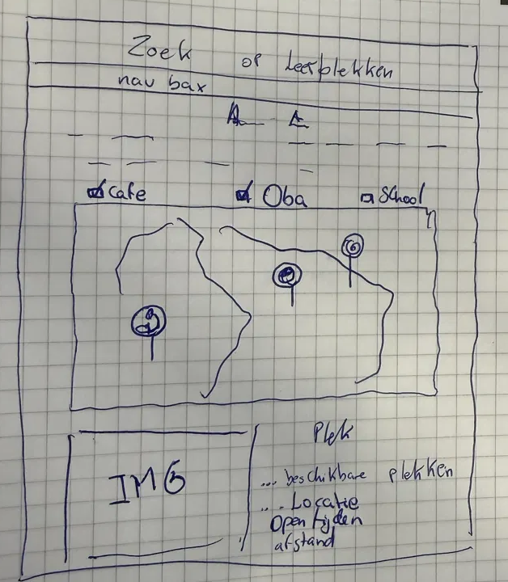
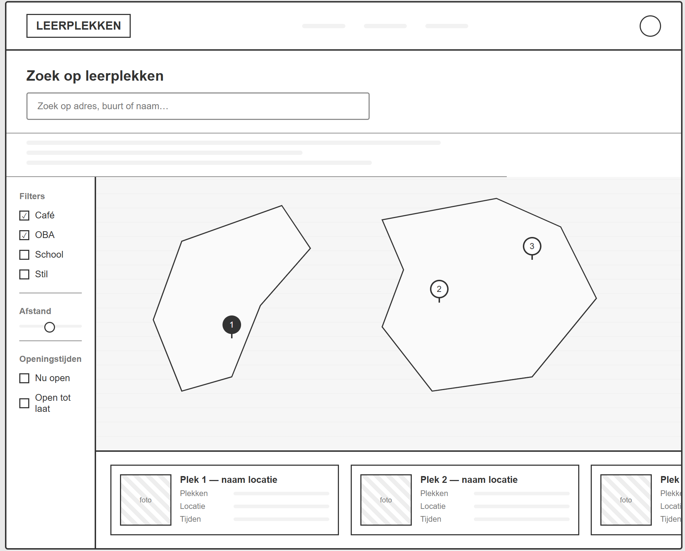

# Think process (schets)

This file is the thinking behind the main page: who it is for, what it does, and why the layout looks the way it does.

## The problem in one sentence

People want a nearby cafe, library, or school to study or work, and they want to see on a map what is open and how busy it feels — without opening five different websites.

## What im solving

- View avaible sits
- Accounts, reviews, or favorites
- The whole of the Netherlands as the place (ill start around Amsterdam)

Those can come after the map + search + card loop works.

## User flow (happy path)

1. Open Leerplekken. The map shows Amsterdam with pins for every place in the data file.
2. Type a name in **Zoek een leerplek…**, and/or tap **Café**, **OBA**, or **School**.
3. Pins that do not match disappear.
4. Click a pin. A detail card opens: name, type, hours, availability, address, distance.
5. Close the card, or click another pin to switch.

If every chip is off, the map shows **all** types. Several chips can be on at once (Cafe + OBA).

## Layout choices

**The map is the product.** Search and filters exist to change what is on the map. The card is extra information, not a second homepage.

**Dutch labels on the screen, English in the code.** The product is for people in the Netherlands. File names and component names stay in English because is an universal lenguage for programming.

## Low-fi sketch — desktop

## Components this sketch becomes

When we build the real page, each box maps to one file:

| On the sketch       | Component     | Job                                          |
| ------------------- | ------------- | -------------------------------------------- |
| Search field        | `SearchBar`   | Lets the user type a name                    |
| Cafe / OBA / School | `FilterChips` | Turns types on and off                       |
| The map rectangle   | `MapView`     | Shows pins; reports which pin was clicked    |
| The detail panel    | `PlaceCard`   | Shows hours, availability, address, distance |

## Midium-fi - desktop

